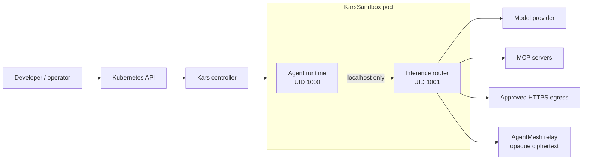

# Kars

**A Kubernetes-native runtime for governed AI agents.**

Kars runs each agent in an isolated pod with a dedicated inference router. In
the Kubernetes production topology, cloud/model credentials remain in the
router rather than the agent process. Model calls, MCP tools, network egress,
sub-agent creation, and inter-agent communication pass through explicit policy
and audit boundaries. The single-container Docker target uses a weaker,
same-container development trust model.

[](https://www.npmjs.com/package/@kars-runtime/cli)
[](LICENSE)
[](https://github.com/Azure/kars/actions/workflows/ci.yml)
[](https://scorecard.dev/viewer/?uri=github.com/Azure/kars)

> Kars is an open-source reference implementation, not an officially supported
> Microsoft product. See [feature maturity](docs/maturity.md) and the
> [compatibility matrix](docs/reference/compatibility.md) before production use.

## Start here

| Goal | Path |
|---|---|
| Run an agent locally in the production-shaped Kubernetes topology | [Local kind quickstart](docs/quickstart.md) |
| Deploy to AKS with the CLI | [AKS getting started](docs/getting-started.md) |
| Install the core chart on an existing cluster | [Helm installation](deploy/helm/kars/README.md) |
| Connect a governed browser or another MCP server | [Managed MCP tutorial](docs/tutorials/managed-mcp.md) |
| Understand the security and trust model | [Architecture](docs/architecture.md) and [security](docs/security.md) |
| Add another agent framework | [Runtime contract](docs/runtimes/CONTRACT.md) |

```bash
npm install --global @kars-runtime/cli
kars dev --release --target local-k8s
kars connect dev-agent
```

The local Kubernetes path uses kind and the same agent/router pod boundary,
NetworkPolicies, seccomp posture, and CRDs used on AKS. Authentication and
infrastructure differ: local development uses development credentials; AKS can
use Workload Identity and per-agent Entra identities.

## Architecture



The router is a per-agent policy enforcement point, not a shared edge gateway.
It brokers:

- model authentication and provider routing;
- Content Safety and token budgets;
- MCP discovery, authentication, tool allow-lists, and session lifecycle;
- strict or learning-mode egress controls;
- AGT governance and trust scoring;
- task telemetry, receipts, and audit evidence;
- keyless GitHub writes;
- sub-agent spawn, handoff, and encrypted mesh transport.

Security guarantees vary by deployment mode. Read
[security guarantees by mode](docs/security.md) rather than assuming that local
Docker, kind, anonymous AKS, Entra-backed AKS, strict egress, and confidential
containers provide identical properties.

## Core resources

Kars installs these user-facing APIs:

| Resource | Purpose |
|---|---|
| `KarsSandbox` | Isolated agent runtime and policy attachment point |
| `KarsTask` | Governed mission with a trust envelope and retained output |
| `KarsTeam` | Standing team that mints task-force runs |
| `KarsProfile` | Reusable team or sandbox blueprint |
| `KarsSkill` | Versioned and approval-gated skill package |
| `KarsApproval` | Human decision for a governed action |
| `KarsReceipt` | Verifiable run and governance evidence |
| `InferencePolicy` | Model routing, safety floors, and token budgets |
| `ToolPolicy` | Tool allow, deny, approval, and rate-limit rules |
| `McpServer` | Managed or external MCP registration |
| `KarsMemory` | Memory Store binding and scope |
| `KarsEval` | Reproducible safety evaluation |
| `TrustGraph` | Declared inter-agent trust topology |
| `EgressApproval` | TTL-bounded network exception |
| `KarsAuthConfig` | Cluster identity and mesh trust configuration |
| `KarsPairing` | Controller-managed peer pairing record |
| `A2AAgent` | Public A2A agent endpoint |
| `KarsSREAction` | Approval-gated SRE remediation |

The generated CRDs are the authoritative API. See
[CRD reference](docs/api/crd-reference.md) and
[lifecycle semantics](docs/api/lifecycle.md).

## MCP in Kars

MCP servers are untrusted tool providers. Agents do not connect to them
directly; the router discovers their tools and forwards governed calls.

Kars supports:

- **managed presets**, where the controller deploys a reviewed workload;
- **external endpoints**, where Kars registers an existing Streamable HTTP MCP;
- router-owned OAuth or static bearer authentication;
- namespaced tools such as `playwright.browser_navigate`;
- stateful-session keepalive and restart recovery.

The managed **Everything MCP** preset is a protocol conformance fixture. It
provides deterministic tools such as echo, sum, resources, structured content,
logging, and long-running operations. It is useful for proving generic MCP
installation, discovery, schema, forwarding, and recovery. It is not a
production integration or a business capability.

Use the managed **Playwright MCP** preset for a meaningful browser automation
integration. See [MCP servers](docs/mcp.md) and the
[managed MCP tutorial](docs/tutorials/managed-mcp.md).

## Runtimes

Kars uses one pod and governance contract across multiple agent frameworks.
Capability parity is not implied merely because an adapter image exists.

| Runtime | Inference | MCP | Mesh/spawn | Live deep validation |
|---|:---:|:---:|:---:|:---:|
| OpenClaw | Yes | Yes | Yes | kind and AKS |
| Hermes | Yes | Native plus governed fallback | Yes | kind and AKS |
| Other first-party adapters | Yes | Adapter-dependent | In progress | See [runtime matrix](docs/runtimes.md) |
| Bring your own | Contract-dependent | Contract-dependent | Contract-dependent | Operator-owned |

## Deployment support

| Environment | Status |
|---|---|
| Local kind | Tested development path |
| AKS | Primary, deeply tested deployment |
| Generic Kubernetes Helm | Templates available; operator supplies identity, registry, inference, mesh, and CNI integration |
| EKS / GKE / OpenShift / other | Not claimed as fully supported until live conformance is published |

The Helm chart is Kubernetes-shaped but contains optional Azure integrations
and Kubernetes-version-sensitive admission controls. Read the
[compatibility matrix](docs/reference/compatibility.md) and
[chart README](deploy/helm/kars/README.md).

## Kars and Kars Bridge

Kars is the independently usable open-source substrate. **Kars Bridge** is a
separate, currently private product experience that composes Kars primitives
into employee, operator, and auditor workflows. Bridge depends on Kars; Kars
never depends on Bridge.

See [Kars and Kars Bridge](docs/concepts/kars-and-bridge.md).

## Documentation

- [Documentation home](docs/README.md)
- [Quickstart](docs/quickstart.md)
- [Architecture](docs/architecture.md)
- [Security](docs/security.md)
- [MCP](docs/mcp.md)
- [Operations](docs/operations/README.md)
- [Troubleshooting](docs/operations/troubleshooting.md)
- [CLI reference](docs/cli-reference.md)
- [Roadmap](docs/roadmap.md)

Build the documentation site locally:

```bash
make docs-site
make docs-site-serve
```

## Contributing

Read [CONTRIBUTING.md](CONTRIBUTING.md) for code contribution workflows and
[documentation contributions](docs/contributing/documentation.md) for page
types, style, examples, and validation.

## License

[MIT](LICENSE)
