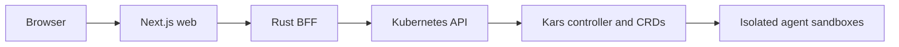

# Kars Bridge

**Mission control for governed agent work.**

Kars Bridge is a human-facing experience layer on top of
[Kars](https://github.com/Azure/kars). Employees launch missions and standing
teams; operators govern providers, MCP servers, skills, egress, budgets, and
approvals; auditors inspect receipts and evidence.

> **Status: integration preview.** The complete application lives in `bridge/`
> in the Kars repository, initially on the `kars-bridge` branch. Source publication
> is not a release, an image publication or a production support commitment.
> Build images in your own registry and configure the chart explicitly.

## Product boundary

**Bridge depends on Kars; Kars never depends on Bridge.**

Bridge owns composition, workflows, visualization, and personas. Kars owns the
CRDs, controller, sandbox isolation, inference router, policies, encrypted mesh,
and durable evidence. Every Kars primitive remains usable without Bridge.
The BFF keeps an independent Cargo manifest and lockfile and is excluded from
the core workspace. Web and Teams gateway retain their own npm packages.
Bridge uses its own additive Helm release; removing it must preserve Kars
resources and customer data. Repository co-location does not change this boundary.

## Start here

| Goal | Documentation |
|---|---|
| Understand the product | [Documentation home](docs/README.md) |
| Install the integration preview | [Quickstart](docs/quickstart.md) |
| Review Kars compatibility | [Compatibility](docs/compatibility.md) |
| Configure identity and roles | [Identity](docs/identity.md) and [RBAC](docs/rbac.md) |
| Run missions and teams | [Missions and teams](docs/missions-and-teams.md) |
| Understand the full team/run/evidence flow | [Team workflows](docs/team-workflows.md) |
| Add Playwright or another MCP | [MCP servers](docs/mcp-servers.md) |
| Govern skills and approvals | [Skills](docs/skills.md) and [approvals/egress](docs/approvals-egress.md) |
| Deploy local GPU models | [Local inference](docs/local-inference.md) |
| Diagnose a failure | [Troubleshooting](docs/troubleshooting.md) |

## Surfaces

| Surface | Persona | Purpose |
|---|---|---|
| Workspace | User, operator, admin | Compose and review missions, teams, connections, and deliverables |
| Operator Console | Operator, admin | Providers, models, policies, MCP, skills, approvals, fleet health, budgets |
| Audit | Auditor, admin | Read-only receipts, evidence, and verification |

These are separate persona boundaries. Workspace links do not depend on Console
routes, and Audit is self-contained.

## Architecture



- The browser never receives Kubernetes credentials.
- The BFF verifies the signed Bridge principal and applies persona checks.
- The BFF ServiceAccount is the aggregate Kubernetes permission ceiling.
- Kars controllers and routers remain the runtime enforcement layer.

## Qualification

The Bridge CI workflow checks the BFF, web, Teams gateway, dependency locks,
security configuration and additive install/removal behavior. The native
workflow checks the application and core from the **same immutable monorepo
commit**. Component checks, older demonstrations and API-only admission are not
substitutes for full native acceptance.

This integration candidate is not yet a qualified release. Credential lifecycle,
observer access and complete governed Team execution must satisfy their
applicable acceptance gates before a release claim. See
[Compatibility](docs/compatibility.md) for the scope of the evidence.

## Develop

Prerequisites:

- Rust 1.88+
- Node.js 22+
- access to a compatible Kars cluster for integration testing

```bash
cd bridge
make dev
make bff
make web
```

The application also defines `make check`; the root repository exposes
`make bridge-check` as an explicit opt-in. Core build targets do not run or
install Bridge. Successful component checks are not full-stack qualification.

`make helm-test` runs offline add-on boundary, namespace retention, readiness
wiring, and optional Teams regressions using Helm and the existing
`teams-gateway` Vitest development dependencies. It is included in `make check`
and needs neither a cluster nor tenant credentials.

The Bridge PR workflow runs BFF, web and gateway quality gates, dependency and
secret audits, configuration scanning, and a disposable-Kind Helm removal test.
It reuses the repository's audit client without a second external checkout.

Local development defaults are intentionally convenient and are not a
production authentication model. See [Identity](docs/identity.md).

## Repository

| Directory | Purpose |
|---|---|
| `bff/` | Rust backend-for-frontend and Kubernetes integration |
| `web/` | Next.js Workspace, Console, and Audit surfaces |
| `teams-gateway/` | Optional Microsoft Teams transport and add-on tests |
| `deploy/helm/kars-bridge/` | Additive Bridge Helm chart |
| `docs/` | Product, operator, deployment, and contributor documentation |

## License

MIT.
