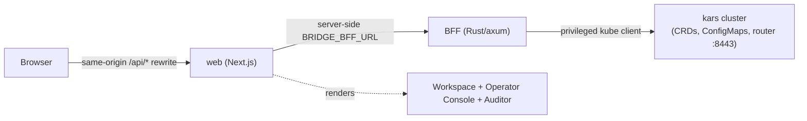
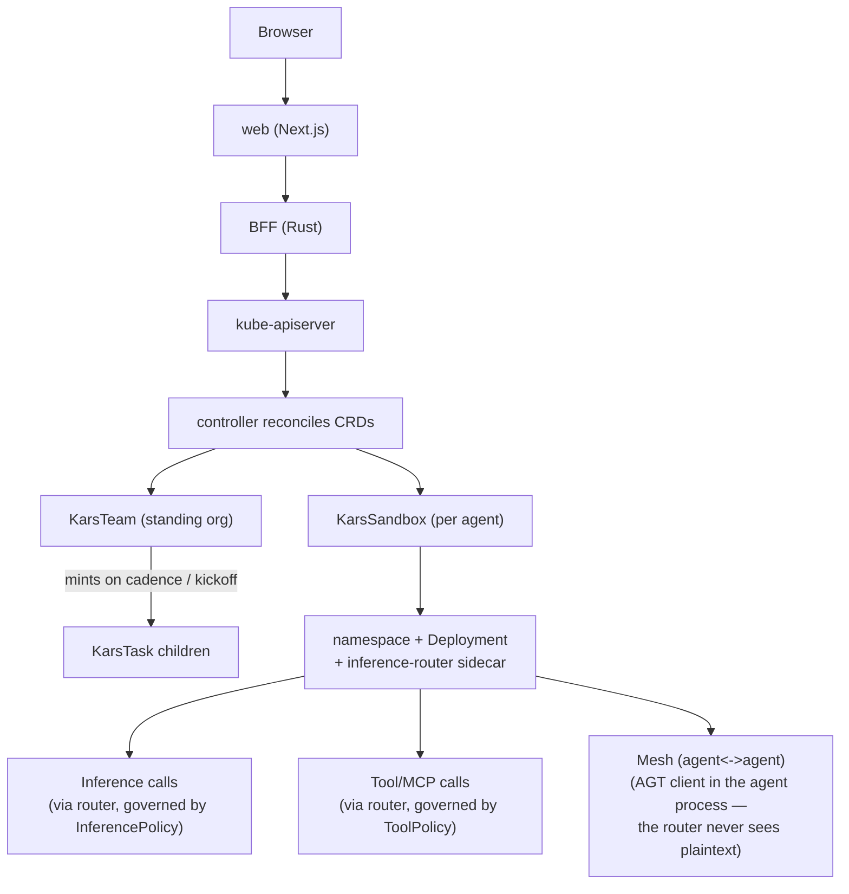
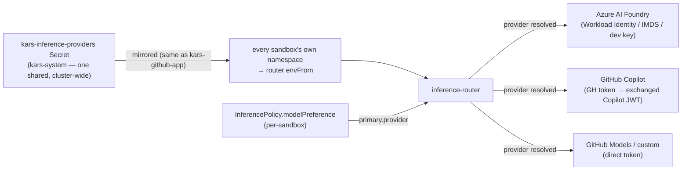
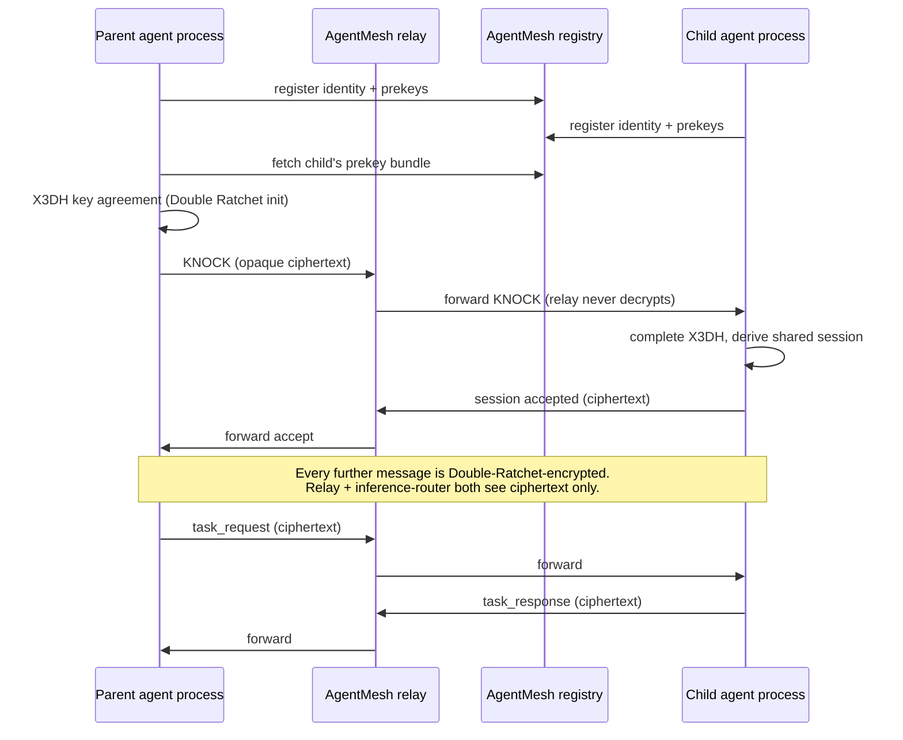
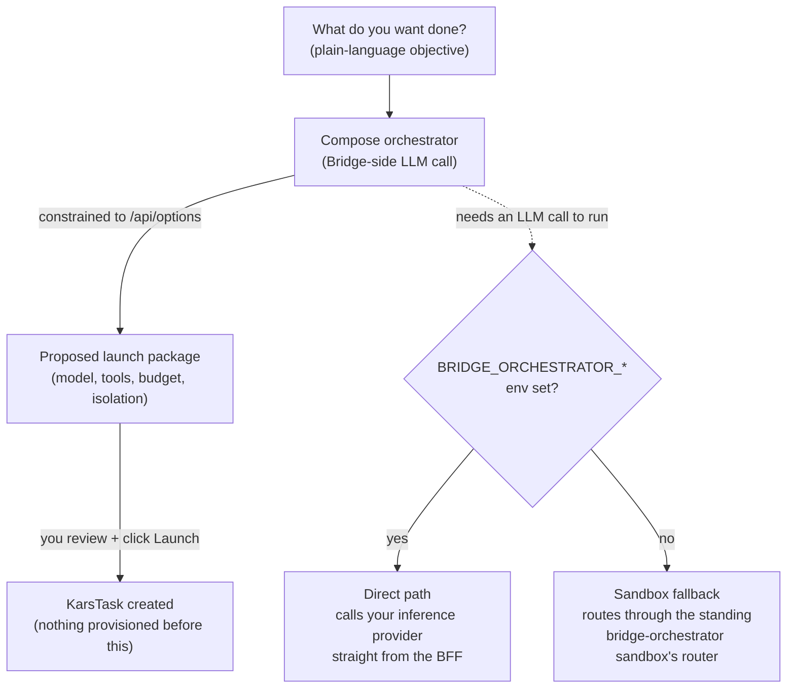

# Architecture

kars Bridge is a **thin product layer** over the kars substrate. It owns the
*experience*; kars owns the *security and governance primitives*.

| Component | Stack | Role |
|-----------|-------|------|
| `web/` | Next.js (React, TS, Tailwind) | The product UI. Server components call the BFF directly (`BRIDGE_BFF_URL`); the browser talks same-origin and the `/api/*` rewrite proxies to the BFF (needed for the SSE telemetry stream). |
| `bff/` | Rust (axum) | Backend-for-frontend — the **only** server-side path between the browser and the cluster. Holds privileged cluster access; the browser never sees kube credentials or signing keys. |

## Hard rule — one-way dependency

**Bridge depends on kars; kars never depends on Bridge.** Every kars primitive
Bridge uses is usable on a plain kars cluster with no Bridge installed. Bridge
only *composes and presents* them. A handful of features required small,
general-purpose additions to the core router/controller (see
[Kars `docs/git-write.md`](https://github.com/Azure/kars) and the channel/budget
notes below) — all of them stand on their own. Private
preview releases must publish the exact compatible Kars commit; see
[Compatibility](compatibility.md).

## How the BFF talks to the cluster

The BFF is a Kubernetes API client. In-cluster it runs as the `kars-bridge`
ServiceAccount under a **least-privilege ClusterRole** — that Role, not the BFF
code, is the real authorization boundary:

- **Reads** the full kars CRD surface (tasks, teams, sandboxes, policies,
  receipts, …) + mission-output/trace/artifact ConfigMaps.
- **Writes** only the envelope objects it authors (KarsTask, KarsTeam) and
  operator-authored governance (ToolPolicy, McpServer, KarsSkill, InferencePolicy,
  KarsProfile, EgressApproval) via Server-Side Apply.
- **Secrets are write-only** — create/patch, never `get`/`list`. The Bridge never
  reads a credential value back.
- **ConfigMaps** it owns (inference budgets, team task backlog, gitconfig) are
  create/patch; everything else is read-only.

See `deploy/rbac.yaml` (or the Helm chart's `templates/rbac.yaml`).

## What Bridge stores where

Bridge is **stateless** — its source of truth is the cluster:

| State | Where |
|-------|-------|
| Missions / teams | `KarsTask` / `KarsTeam` CRs |
| Deliverables, traces, artifacts | mission-output / trace / artifact ConfigMaps (controller-written) |
| Inference budgets (cluster/workspace) | `kars-inference-budgets` ConfigMap |
| Team task backlog | `kars-team-tasks-<team>` ConfigMap |
| Workspace channels | `kars-workspace-channels` secret (write-only) |
| GitHub connection | `kars-github-connection-<subject-hash>` ConfigMap (per principal; installation/account/repos only) |
| Receipts / inclusion log | `KarsReceipt` CRs (controller-signed) |

## Live telemetry

The Activity view and agent graph consume ONE SSE stream per run
(`/api/namespaces/{ns}/tasks/{name}/stream`), which the BFF aggregates across the
principal sandbox **and** every sub-agent it spawned, tagging each event with the
emitting agent. See [Observability](observability.md).

## The whole system, end to end

Bridge sits on top of a real Kubernetes operator (kars core, `Azure/kars`) —
this section is the map that ties the pieces together: what the **controller**
does, how agents talk over the **mesh**, how **communication channels** work,
and what the **compose orchestrator** actually is (a term this product
overloads for two different things — see below).

### The controller — what it actually does

`kars-controller` is a standard Kubernetes operator: it watches every kars CRD
(`KarsTask`, `KarsTeam`, `KarsSandbox`, `ToolPolicy`, `InferencePolicy`,
`McpServer`, `KarsSkill`, `KarsReceipt`, `KarsSREAction`, …) and reconciles each
towards its declared spec. Concretely, for a mission: a `KarsTask` reconcile
validates the trust envelope, then (once `execution.launch=true`) materializes
a `KarsSandbox` — which itself reconciles into a real namespace, a Deployment
(the `openclaw`/`hermes` agent container **plus** an `inference-router`
sidecar), a NetworkPolicy default-denying egress, and the governance
ConfigMaps (ToolPolicy → AGT profile, egress allowlist). Bridge never talks to
a sandbox directly — it only ever reads/writes CRDs; the controller is the
only thing that touches Deployments, NetworkPolicies, and Secrets.

Full CRD reference + the "why ten (now more) CRDs, not one" rationale:
[kars docs → Architecture § CRDs as the API](https://github.com/Azure/kars/blob/main/docs/architecture.md#crds-as-the-api).

### Multi-provider inference routing — one sandbox, several providers

Every sandbox's `inference-router` sidecar holds credentials for **one
default** provider (from cluster setup) but can ALSO carry any number of
**additional** providers — connected from the same Configuration → Inference
provider wizard (its "Where it applies" step asks whether a given connection
is the cluster default or an additional one; e.g. GitHub Copilot as the
default, Azure AI Foundry and GitHub Models also connected). All of them
reach every sandbox — which one a specific request actually uses is decided
**per request** by that sandbox's `InferencePolicy.modelPreference.primary.
provider`, never by what's merely present in the environment. A
cross-provider fallback chain (`modelPreference.fallback[]`) also works — a
5xx/429 on the primary provider's model retries the next entry, on ITS OWN
provider if named.

The Secret's keys ARE the literal env var names the router parses
(`KARS_PROVIDER_<TAG>_ENDPOINT`/`_API_KEY`/`_TOKEN`, or the well-known
`COPILOT_GITHUB_TOKEN` for the Copilot special case) — connecting a new
provider from the Bridge UI needs no router or controller code change.
Credentials live ONLY in the router container (UID 1001); the agent never
receives them.

**Known limitation — no live rollout trigger.** Environment variables sourced
from a Secret (`envFrom`) are read once at container start; Kubernetes does
not hot-reload them into a running process. Connecting/removing an
additional provider updates the shared `kars-inference-providers` Secret
immediately, but an **already-running** sandbox's router won't see the change
until its pod restarts (a fresh mission/team launch always gets the current
Secret, since it's a brand-new pod). There's no automatic rollout-restart of
in-flight sandboxes today — if you need an existing long-running sandbox to
pick up a newly connected provider immediately, restart its pod
(`kubectl delete pod` — the Deployment recreates it) rather than waiting.

### The mesh — how agents actually talk to each other

When a mission spawns a sub-agent (or a team's members need to hand off work),
the two agents do **not** talk through the controller or the BFF. Each agent
process runs an AGT mesh client (TypeScript for OpenClaw, Python for Hermes)
that registers identity, runs X3DH key exchange, and opens a **Signal-Protocol,
end-to-end-encrypted** session over the AgentMesh relay. The
`inference-router` sidecar is **not** part of this path for message content —
it only proxies inference/tool calls; the relay and the router both see
opaque ciphertext, never plaintext. This is why the Bridge's mesh topology
graph (Operator Console → Sandboxes) can show *that* two agents are linked
(a proven parent→child delegation) but never *what* they said.

Full mechanics (KNOCK, Double Ratchet, trust thresholds):
[kars docs → Architecture § The mesh](https://github.com/Azure/kars/blob/main/docs/architecture.md#the-mesh).

### Communication channels — proactive reporting to humans

Separate from the mesh (agent↔agent) and A2A (cross-org), **channels**
(Telegram, Slack, Discord, WhatsApp) are how an agent reports to a **person**.
Wired once per workspace (Workspace → Connections), the controller copies the
resulting write-only secret into every run sandbox's credentials before the
pod starts, so any harness's entrypoint picks it up — agent-agnostic by
design, not per-harness plumbing. Today Telegram is wired for **proactive**
push (the agent decides to send an update); Slack/Discord/WhatsApp are
**inbound conversational** (you message the agent, it replies). Full
mechanics + the exact env keys each channel reads:
[Connections](connections.md).

### The compose orchestrator — two different things, one confusing name

"Orchestrator" means two unrelated things in this product, and that overload
is itself a common source of confusion:

1. **Team charter loop (kars core, `KarsTeam` reconciler).** A standing team
   is long-lived governance over short-lived work: the controller mints a
   fresh `KarsTask` from the team's charter either on a configured cadence, on
   an explicit "Run now", or — for a **cadence-less** team — exactly once as a
   kickoff run when the team is first created (so standing up a team always
   produces work, never sits silently idle). This has nothing to do with LLM
   calls the Bridge itself makes; it is the controller autonomously running
   your team's mandate on a schedule.

2. **The compose orchestrator (Bridge-side, "intent → package").** The
   Workspace's "What do you want done?" composer turns a plain-language
   objective into a *proposed* governed launch package (model, tools, budget,
   isolation) by making its own LLM call — constrained to only reference real
   building blocks this cluster actually offers (`/api/options`); nothing is
   provisioned until you review and click Launch. That LLM call needs
   somewhere to run, and there are exactly two paths, health-checked live on
   the Console home page:
   - **Direct** — `BRIDGE_ORCHESTRATOR_{ENDPOINT,TOKEN,MODEL}` set, calling
     your inference provider straight from the BFF. Scales independently of
     any sandbox; recommended once you have concurrent teams.
   - **Sandbox fallback** — routes through the standing `bridge-orchestrator`
     sandbox's own inference-router. This is what a fresh install gets for
     free with zero extra config, at the cost of a single-sandbox dependency.

   Neither path is "the orchestration engine" in the sense of running your
   missions — composing a package and launching it are two separate steps;
   compose only ever proposes.

