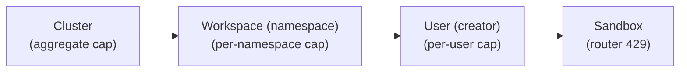

# Inference budgets

Bridge adds a **hierarchy** over inference token spend, above the per-sandbox
`InferencePolicy` the kars controller already compiles and the router already
enforces (429 per sandbox):



Configure it in **Operator Console → Policies → Inference budgets**.
The UI reserves cluster/workspace increases for admins. The current BFF groups
many mutation routes under the operator persona, so deployments that require a
hard admin boundary must verify server-side enforcement for their release. See
[RBAC](rbac.md).

## Enforcement modes

Each level has one of three modes:

| Mode | Behavior |
|------|----------|
| **passive** | Never blocks. Raises an alert when over budget (the meter turns amber). |
| **buffer** | Allows up to `limit × (1 + bufferPercent/100)`, then blocks. An admin must raise it to proceed. |
| **strict** | Blocks at 100% of the limit. Only an admin can raise it. |

## How it's measured & enforced

- **Measured** daily (UTC) from completed run outputs — the same `totalTokens` the
  efficiency engine reads — aggregated per cluster and per namespace.
- **Enforced** by the Bridge at the point work is launched: `create_task` (on
  launch), `create_team` (on launch), and `run_mission` call
  `enforce_launch_budget(cluster, ns)`. A `strict`/over-buffer level returns
  `422` with an admin-raise message; `passive` always passes (and surfaces as an
  alert). The per-sandbox cap is separately enforced by the router.
- **Stored** in the `kars-inference-budgets` ConfigMap (`kars-system`), key
  `budgets.json`:
  ```json
  {
    "cluster": { "daily_tokens": 1000000, "mode": "buffer", "buffer_percent": 20 },
    "workspaces": {
      "kars-system": { "daily_tokens": 300000, "mode": "strict", "buffer_percent": 0 }
    }
  }
  ```

## Editing policies

The **per-sandbox** policies (`InferencePolicy` CRs) are mostly
controller-generated from each mission's budget. On the same page an operator can:

- **author** a standalone `InferencePolicy` (a selector + token budget +
  content-safety floor) — `PUT /api/operator/inferencepolicies`;
- **edit** a policy's daily budget in place — `PATCH …/inferencepolicies/{name}`;
- **remove** an authored one.

## API

| Method | Path |
|--------|------|
| GET | `/api/operator/inference-budgets` — hierarchy + live measured usage |
| PUT | `/api/operator/inference-budgets/cluster` — set/clear the cluster cap |
| PUT | `/api/operator/inference-budgets/workspaces/{ns}` — set/clear a workspace cap |

Utilization also surfaces on **Insights → Budget utilization** (live meters).
