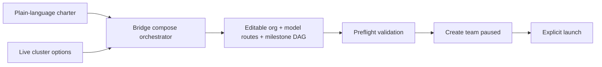
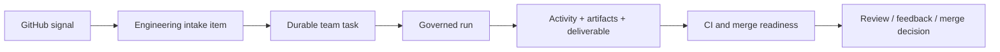
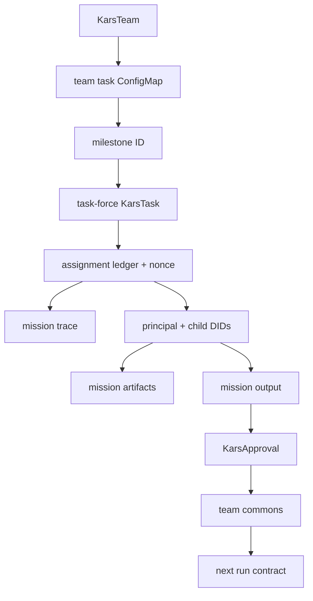

# Team workflows: from intent to reviewed outcome

This guide ties together the Bridge concepts that appear across the Workspace:
teams, engineering intake, work queue, runs, activity, artifacts, deliverables,
approvals, outcomes, and memory.

Bridge presents these states; Kars owns and persists them. This page describes
the product contract. The monorepo integration candidate has not yet qualified
the complete controller/runtime journey; see [Compatibility](compatibility.md).
In particular, importing the UI does not provide missing governed task delivery,
authenticated runtime transport, or restart-recovery behavior in an older core.

## The short version

```text
Intent
  -> proposed org + milestone graph
  -> human review + preflight
  -> standing team
  -> one eligible milestone
  -> one governed run
  -> principal + selected specialists
  -> activity, artifacts, and structured handbacks
  -> principal deliverable + truthfulness gate
  -> optional human review
  -> approved team memory + next milestone
```

## What each Workspace concept means

| Workspace concept | What it is | What it is not |
|---|---|---|
| Team | A persistent charter, org chart, authority envelope, backlog, memory identity, and explicit runtime lifecycle policy. | A single run or an implicitly permanent pod. |
| Work queue | Durable milestones/tasks the team will execute. | A live event stream. |
| Run | One attempt to execute one milestone or charter tick. | The whole lifetime of the team. |
| Execution flow / activity | The chronological signal inside one run. | A separate work item. |
| Agent | A principal or specialist worker selected for the run. | The durable team itself. |
| Artifact | A file produced by an individual agent or the principal. | The final outcome classification. |
| Deliverable | The principal's final synthesis for the run. | Every raw agent file. |
| Outcome | Delivered, delivered with issues, no action, incomplete, or failed. | A model's self-reported confidence. |
| Approval | A typed human decision that changes workflow state. | Free-form feedback with no controller effect. |
| Memory | Approved retained knowledge injected into later runs. | A replay of every raw conversation. |
| Engineering intake | Repository signal discovery and backlog creation. | The activity timeline or the agents doing the work. |

## 1. Compose a team

From **Workspace -> Teams -> Set up a team**, enter a standing charter. The
Bridge composer reads the live cluster palette and proposes:

- a principal/default model;
- 2-4 focused evidence roles;
- per-role harness and model overrides;
- MCP services, egress mode, and public hosts;
- autonomy tier and cadence;
- runtime lifecycle and warm-idle policy;
- engineering intake settings for repository maintenance;
- a 2-8 milestone DAG for finite work.

The proposal is editable. It is not execution.



If the model response is malformed, Bridge performs one bounded repair. It does
not present generic fallback roles as a successful AI recommendation.

### Runtime lifecycle modes

Lifecycle mode controls runtime retention, not workflow durability. The charter,
queue, approvals, receipts, and approved memory remain durable in every mode.

| Mode | Runtime behavior | Use when |
|---|---|---|
| **Resource optimized** | Reuses the same principal while warm, then suspends it after the configured idle window. New work resumes the same team identity. | Default for most standing teams. |
| **Persistent** | Keeps the principal runtime ready until an operator explicitly pauses the team. | Low-latency work justifies continuous resource use. |
| **Ephemeral** | Creates a clean isolated runtime for each assignment and tears it down after evidence is retained. | Maximum isolation or compatibility with earlier teams. |

The controller never auto-suspends a runtime while an assignment is active or a
milestone is awaiting review. Pausing a team explicitly suspends retained
runtimes in all modes.

## 2. Understand the milestone graph

Each milestone contains:

- stable ID;
- title and description;
- preferred owner role;
- dependencies;
- acceptance criteria;
- optional review gate.

Only a milestone whose dependencies are `done` may run. A milestone in
`active` or `awaiting_review` blocks later assignments. This is why a team can
have many queued milestones but only one current execution cell.

## 3. Launch and watch a run

**Run now** creates a one-shot request. The BFF rejects a second request while
one is pending or active, and the button changes to **Run in progress**.

The run page has four views:

1. **Overview:** role selection and durable handback state.
2. **Execution flow:** searchable lifecycle, tool calls, reasoning cost, and
   truthfulness decision.
3. **Deliverables:** principal output plus retained role artifacts.
4. **Research & egress:** network attempts, remote HTTP results, and actual
   network denials.

The signal path summarizes the expected order:

```text
controller assignment -> principal -> specialists -> tools -> handbacks -> truthfulness gate
```

An in-flight page never calls work "verified." Verification appears only after
the terminal evidence gate.

## 4. Activity, artifacts, and deliverable

These answer different questions:

- **Activity:** What happened, in what order, and where did it fail?
- **Artifacts:** What files did each agent produce?
- **Deliverable:** What did the principal conclude after reviewing handbacks?

Examples:

| Evidence | Typical location |
|---|---|
| Model round and tool result | Execution flow |
| `application-engineer` report | Role artifact |
| `task-checkpoint.json` | Deliverables and checkpoint panel |
| Principal readiness report | Deliverable |
| Missing handback | Role delivery and truthfulness failure |

Internal evidence files such as `collaboration.jsonl` and
`subagent-telemetry.jsonl` remain durable even after child sandboxes are gone.

## 5. Checkpoint and restart

Every milestone receives a controller-owned, nonce-scoped checkpoint before
task delivery. The run page shows it as **Durable milestone checkpoint**.

If the principal pod restarts, the controller:

1. discovers the new worker identity;
2. preserves the same task nonce;
3. rereads the checkpoint;
4. reroutes the verified contract;
5. records **Worker restarted; assignment rerouted** in Execution flow.

The replacement does not consume a checkpoint from an older run.

## 6. Review and request changes

When a review-required milestone delivers, its work-queue state becomes
**Awaiting review**.

- **Approve milestone:** the milestone becomes `done`, dependent work unlocks,
  and the approved output is promoted to team memory.
- **Request changes:** feedback is required, appended with the source run, and
  the milestone returns to `pending`.

The source run remains immutable evidence in both cases.

Approval is a typed `KarsApproval`; Bridge is not required for Kars to resolve
the decision.

## 7. Memory continuity

Runtime lifetime depends on the selected lifecycle mode. Team continuity never
depends on pod lifetime; it is persisted through:

- its `KarsTeam` charter and roster;
- its durable work queue;
- approved entries in team commons.

The team page displays the count of **carried-forward memories**. Later runs
receive recent approved entries in an untrusted reference-data frame. Memory
may inform work, but it cannot override the current charter or contract.

Review-required output is not promoted before approval.

## 8. Engineering intake

Engineering intake continuously observes configured repository signals such as
Dependabot PRs, vulnerability alerts, code scanning, and secret scanning.

It belongs before the work queue:



The intake item links to the exact run that handled it. Opening the run shows
the activity and agents; opening its deliverables shows what they produced.

## 9. Egress decisions

The UI separates two failure classes:

- **Network denied:** the sandbox boundary blocked an unapproved host. This is
  eligible for an `EgressApproval`.
- **Remote error:** the request reached the host and received an HTTP response
  such as 404 or 500. Approving egress cannot fix it.

Research teams should prefer governed search and a bounded source list. Do not
approve speculative host fan-out simply to make a run green.

## 10. Failure and recovery guide

| Symptom | Read first | Typical action |
|---|---|---|
| Run never reaches Working | Deploy timeline and latest lifecycle event | Check sandbox materialization, image pull, gateway, and mesh registration. |
| Role says Handback failed | Role delivery, then matching execution event | Read the retained failure preview; retry only after correcting the cause. |
| Missing handback | Collaboration events and child lease | Confirm the child received the task and sent progress; do not trust the principal narrative alone. |
| Repeated role work | Role plan and assignment IDs | Confirm completed assignments are idempotent and recovery uses a fresh worker generation. |
| Egress request | Research & egress | Approve only a task-specific host; deny optional metadata or speculative sources. |
| Run claims success but is rejected | Truthfulness panel | Use the listed missing role/artifact/acceptance evidence as the source of truth. |
| Need to stop a runaway run | Emergency stop | Enter a reason; Bridge pauses the team and preserves evidence. |

## 11. Relationship map



This is the simplest way to answer "where did this come from?":

1. start from the team;
2. find the milestone in Work queue;
3. follow its `run`;
4. inspect role activity and artifacts;
5. read the principal deliverable and truthfulness result;
6. inspect the approval and resulting memory entry.
