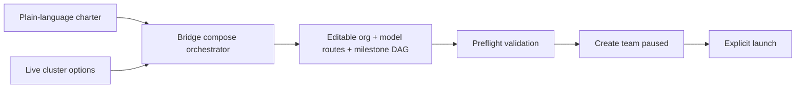
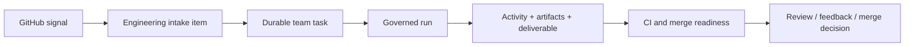
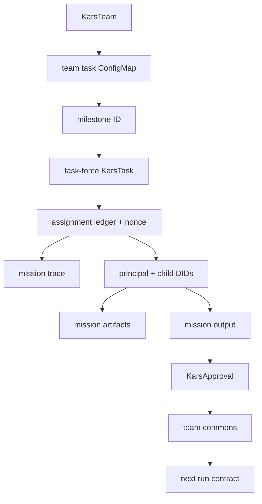

<!-- Copyright (c) Microsoft Corporation.
Licensed under the MIT License. -->

# Team workflows: from intent to reviewed outcome

This guide ties together the Bridge concepts that appear across the Workspace:
teams, engineering intake, work queue, runs, activity, artifacts, deliverables,
approvals, outcomes, and memory.

Bridge presents these states; Kars owns and persists them. This page describes
the product contract. The monorepo integration candidate has not yet qualified
the complete controller/runtime journey; see [Compatibility](compatibility.md).
In particular, importing the UI does not provide missing governed task delivery,
authenticated runtime transport, or restart-recovery behavior in an older core.

## The short version

```text
Intent
  -> proposed org + milestone graph
  -> human review + preflight
  -> standing team
  -> one eligible milestone
  -> one governed run
  -> principal + selected specialists
  -> activity, artifacts, and structured handbacks
  -> principal deliverable + truthfulness gate
  -> optional human review
  -> approved team memory + next milestone
```

## Current execution boundary

A reviewed `kars.execution-plan/v1` is retained in Task and Team blueprints,
including role overrides, replication, authority digests and signed launch
packages. Bridge compares the API's captured plan with the reviewed plan before
continuing creation or plan updates. An older CRD that prunes the plan must fail
this check; saving a name or objective is not equivalent to saving the plan.

**Full typed-plan execution is not implemented yet.** The production encrypted
mission path delivers an objective to one runtime; it does not execute the reviewed
role DAG or schedule its phases with per-role budgets and synthesis. The tested
single-phase contract below is not yet authorized by the production Task store.
A valid plan can be saved inactive for review, but launch, resume and manual run
requests reject it with `TypedPlanExecutionUnavailable`. A decomposition marker
without its plan, or an unsupported marker, rejects with
`ReviewedExecutionPlanMissing`. A missing plan is not a legacy fallback when a
marker declares one. Stopping a Task or purely pausing a Team remains allowed.
Unmarked legacy planless execution remains supported.

The OpenClaw measured loop and encrypted mission protocol support a tested
**single-phase filesystem contract**. Version 2 requires a canonical phase and
its SHA256 digest in readiness, assignment and replies; version 1 cannot silently
drop constraints. Only explicitly granted `filesystem-read`/`filesystem-write`
tools are exposed, actual calls are checked again, and router policy authorization
is still required. `maxToolCalls` limits attempted calls (including denied,
malformed and failed calls); an overflowing batch fails before any tool runs.
`minToolCalls` counts only successful authorized filesystem operations.

The runtime reports copied accounting after each response, batch reservation and
attempted call. The receiver and durable journal reject changed contracts,
regressing counters and erased evidence. Unknown usage cannot become known after
consumption. Failures retain validated counters but export no artifacts; an
unmeasured failure reports unknown usage. Bounded immutable replies and cached
terminal replay preserve the journal limit without re-executing tools. Tests
exercise real HTTP/filesystem execution through the receiver at 25 model rounds
and 32 tool attempts, including failure and exact replay.

These are library/runtime and in-process durability proofs, **not live Team
activation**. The production store still rejects new dispatch for any typed plan,
decomposition marker or caller-supplied phase; previously claimed attempts remain
recoverable without resend. Trusted Task-level plan/phase authority, role
scheduling, fresh-context handoffs and per-role/synthesis budgets remain required.
Unsupported capabilities and required tool contracts fail before inference. This
single-phase support must not be used to unlock typed-plan activation.

The roster alone is not proof that specialists performed work. The published
manual-run admission path is distinct from engineering intake and milestone
execution: automatic queue claiming, dependency advancement and revision-bound
checkpoint continuation still need their consumers. The journey below is the
intended product contract, not a claim that those integrations are complete.

## Reviewed Team lifetime budget

New Teams created in Bridge require an explicitly reviewed positive whole-number
**token limit** with `GovernedInference` scope. There is no preselected cap.
The same Team-UID lifetime account bounds the principal, members and every run,
including later intake; starting another run does not replenish the allowance.
Changing the cap invalidates the composer's previous pre-flight result.
Pre-flight and model-route qualification check the proposed envelope, not whether
its eventual live budget account, broker or provider reservation is ready.

The API retains compatibility with omitted/null budgets for legacy callers; this
is not governed budget enrollment. When a budget is supplied, it must have
explicit `GovernedInference` scope and at least one positive safe whole-number
limit (tokens and/or micro-USD). Empty, zero, negative, fractional and unsafe
limits are rejected, not silently removed. Principal, specialist and fallback
route qualification uses the reviewed token limit. Route edits use the stored
limit and cannot increase it. Team detail shows the configured limit and scope,
not a guessed remaining balance. A changed lifetime limit requires a separately
reviewed new Team, not editing or removing an existing Team's cap. Team update
requests that explicitly include `budget`, even `null`, are rejected; unrelated
route or lifecycle edits keep the stored lifetime limit.

Creation remains paused by default. The UI's opt-in launch sequence creates the
Team paused, installs its queue and engineering settings, then requests resume;
that sequence does not bypass the typed-plan activation guard above. Until a
plan-aware executor is available, retain the Team as a reviewed paused draft.
This budget contract alone is not proof of useful Team delivery or beta readiness.

## What each Workspace concept means

| Workspace concept | What it is | What it is not |
|---|---|---|
| Team | A persistent charter, org chart, authority envelope, backlog, memory identity, and explicit runtime lifecycle policy. | A single run or an implicitly permanent pod. |
| Work queue | Durable milestones/tasks the team will execute. | A live event stream. |
| Run | One attempt to execute one milestone or charter tick. | The whole lifetime of the team. |
| Execution flow / activity | The chronological signal inside one run. | A separate work item. |
| Agent | A principal or specialist worker selected for the run. | The durable team itself. |
| Artifact | A file produced by an individual agent or the principal. | The final outcome classification. |
| Deliverable | The principal's final synthesis for the run. | Every raw agent file. |
| Outcome | Delivered, delivered with issues, no action, incomplete, or failed. | A model's self-reported confidence. |
| Approval | A typed human decision that changes workflow state. | Free-form feedback with no controller effect. |
| Memory | Approved retained knowledge injected into later runs. | A replay of every raw conversation. |
| Engineering intake | Repository signal discovery and backlog creation. | The activity timeline or the agents doing the work. |

### Current artifacts versus retained evidence

The mission artifact download endpoint serves only the current committed run of
a live Task in `kars-system`. Its Task UID, requested/completed run nonce and
artifact ownership must match. A missing, recreated or superseded Task does not
make an old file current. Downloads require an explicit `run_nonce` query
parameter; omitted revisions return 400, superseded or incomplete revisions 409,
and missing or inaccessible records 404. Ownership and revision are rechecked
after reading evidence and before serving bytes. Retained historical evidence is
a separate capability; this endpoint does not establish artifact access after
Task deletion.

### Revision-bound mission evidence

Mission detail and list results join the live Task UID with its exact requested
and completed revision, not a name-only retained output. A changed or deleted
Task during a detail read withholds that response. Feedback requests a distinct
revision; it does not prove the next execution has started.

For durable agent results, the recorded producer includes agent DID, assignment,
Task UID, sandbox/pod/boot identity, and timestamps. Current registry identity is
not evidence of who produced an earlier result. Whole-run usage comes from a
validated terminal record; cumulative progress snapshots are never added together.
Missing usage or activity is unavailable, not zero. Revision-pinned activity
streams close when the revision changes and only signal completion from a
matching terminal result, never merely because an artifact exists. If detailed
trace records are unavailable, Activity says so instead of showing a zero-work
graph or asking you to launch an already completed run. Available assignment and
approval records remain visible, without claiming a complete timeline. Produced
and review-history timestamps use explicitly labelled UTC for consistent display
across server rendering and browser timezones.

Approval requires an eligible useful successful result in the current revision.
Invalid terminal evidence cannot authorize a review mutation. Task-level receipts
without revision binding are explicitly labelled as such. Budget/failure messages
are reported observations, not independent accounting, proof of a root cause,
or a promise of reset or automatic recovery.

### Explicit text attachments on mission success

The bounded mission dispatcher advertises `artifactFormat: "text-v1"`. With a
compatible OpenClaw runtime, an authorized `file_write` can supply `artifact_name`
to attach the exact UTF-8 content it successfully wrote. The final answer remains
`response.md`; a path or an “artifact ready” message is not the document itself.
When attachment support is absent, the agent must return the complete answer
inline instead.

Attachments use flat filenames (letters/digits first, then letters, digits,
periods, underscores or hyphens; at most 128 characters). `response.md`,
`__proto__`, `constructor` and `prototype` are reserved. There may be at most
16 additional files, totaling 128 KiB of serialized JSON including UTF-8 text,
escaping and filenames. The entire encrypted mission payload remains bounded by
192 KiB, including final answer and evidence; exceeding it fails the mission.

A null or omitted `artifact_name` is local-only scratch. Nothing scans the
filesystem, reads older files, or implicitly exports output from another tool.
The last successful explicitly attached write to a name wins; later local-only
or failed writes do not replace it. Staged attachments are execution-local and
publish only with a successful terminal result, never on failure or in a later
revision. Named files share the current-run ownership and download fences above.
Transport success and valid files still require review for useful content.

### Engineering intake identity and existing PRs

Dependabot remediation work uses a versioned identity containing the repository,
the exact case-sensitive manifest path, and package name. For example,
`Services/package-lock.json` and `services/package-lock.json` are different
targets. Missing manifest metadata is also different from a file named
`unknown`. Repository casing does not create duplicate work.

Existing work IDs, runs, receipts, dependencies and history are not renamed.
Intake reuses an older remediation ID only when its retained structured source
metadata proves the same repository, manifest and package. If that evidence is
missing or ambiguous, the old history remains intact, the new versioned work is
tracked separately, and intake reports the ambiguity for review.

Open alerts for one target are aggregated by alert number, independent of poll
order. Comparison uses structured advisory and dependency facts, not titles,
candidate PR links, or poll timestamps. Unassigned pending work is refreshed in
place. Once a run or assignment nonce exists, its approved input is immutable:
new findings become a separate follow-up backlog task, dependent on unfinished
prior work. Completed task IDs, runs and PR evidence stay intact. Findings already
represented in retained work do not endlessly reopen on unchanged polls.

Only a complete successful open-alert scan can remove absent findings from
unassigned work. Empty pending work is labelled a source-only retirement, not a
delivered fix. Truncated scans retain unresolved pending findings; a later complete
scan determines withdrawals. Follow-ups include only newly observed source facts
and links to prior backlog/run evidence.

A PR title mentioning the package or advisory is only a search hint. It does
not prove that the PR fixes this manifest, does not mark remediation delivered,
and does not suppress new work. The assigned agent must inspect the actual diff
and current head-SHA evidence, reusing a matching PR rather than creating a
duplicate. Distinct manifest fixes must not be closed as duplicates.

## 1. Compose a team

From **Workspace -> Teams -> Set up a team**, enter a standing charter. The
Bridge composer reads the live cluster palette and proposes:

- a principal/default model;
- 2-4 focused evidence roles;
- per-role harness and model overrides;
- MCP services, egress mode, and public hosts;
- autonomy tier and cadence;
- runtime lifecycle and warm-idle policy;
- engineering intake settings for repository maintenance;
- a 2-8 milestone DAG for finite work.

The proposal is editable. It is not execution.


```mermaid
flowchart LR
    Intent["Plain-language charter"] --> Composer["Bridge compose orchestrator"]
    Palette["Live cluster options"] --> Composer
    Composer --> Proposal["Editable org + model routes + milestone DAG"]
    Proposal --> Preflight["Preflight validation"]
    Preflight --> Create["Create team paused"]
    Create --> Launch["Explicit launch"]
```

If the model response is malformed, Bridge performs one bounded repair. It does
not present generic fallback roles as a successful AI recommendation.

### Runtime lifecycle modes

Lifecycle mode controls runtime retention, not workflow durability. The charter,
queue, approvals, receipts, and approved memory remain durable in every mode.

| Mode | Runtime behavior | Use when |
|---|---|---|
| **Resource optimized** | Reuses the same principal while warm, then suspends it after the configured idle window. New work resumes the same team identity. | Default for most standing teams. |
| **Persistent** | Keeps the principal runtime ready until an operator explicitly pauses the team. | Low-latency work justifies continuous resource use. |
| **Ephemeral** | Creates a clean isolated runtime for each assignment and tears it down after evidence is retained. | Maximum isolation or compatibility with earlier teams. |

The controller never auto-suspends a runtime while an assignment is active or a
milestone is awaiting review. Pausing a team explicitly suspends retained
runtimes in all modes.

## 2. Understand the milestone graph

Each milestone contains:

- stable ID;
- title and description;
- preferred owner role;
- dependencies;
- acceptance criteria;
- optional review gate.

The intended dependency contract allows only a milestone whose dependencies are
`done` to run; `active` or `awaiting_review` work must block dependent assignments.
The graph records that contract, but its automatic execution and review
continuation are not yet connected to the durable manual-run consumer. Do not
interpret queued milestones or a successful queue write as agent activity.

## 3. Launch and watch a run

**Run now** records a one-shot request, not proof that an agent started or
produced a deliverable. The BFF checks the current owner and Team UID, rejects
paused Teams, pending requests and exact-owned active task forces, and writes
with UID/resourceVersion preconditions. Active-run checks cover the entire
namespace; labels alone neither establish ownership nor hide a running Task.
Concurrent Team changes return a conflict instead of overwriting newer intent.

The manual admission protocol separates durable stages:

1. Stage an exact-owned, **unlaunched** Task under a stable request identity.
2. Persist its Task UID, authority/spec digests and admission sequence in
   `status.runAdmission`, counting the reservation once.
3. Recheck current authority, finite shared budget and capacity; activate that
   exact Task with UID/resourceVersion preconditions.
4. Acknowledge only the matching request. A retry after a lost acknowledgement
   reuses the reservation rather than creating or relaunching work.

The latest admission remains after acknowledgement. Requests use canonical
`manual-<sequence>-<sha256>` identities; a later request advances the sequence
and creates a distinct Task under the same Team budget root, without resetting
settled spend. Missing, replaced or altered reserved Tasks fail closed rather
than being recreated. Credential drift still pauses the runtime promptly; only
its final credential-spec rewrite waits for a pending acknowledgement so the
original admission spec can be verified before rebinding.

Legacy timestamp-only `run-now` annotations are not silently converted or
executed. They remain rejected/pending. An operator must inspect the Team and
retained Task evidence before clearing an obsolete request with current UID/RV
preconditions and submitting a new reviewed request. Do not clear the retained
admission watermark, replay an old sequence, or treat a retry as permission to
reset the budget.

These are bounded cross-object checks, not a distributed transaction or lease.
A request, reservation, acknowledgement, Ready pod or generated-task count is
not delivery evidence. Manual admission also does not establish engineering
backlog assignment or checkpoint/revision continuation; those paths require
their own connected evidence and acceptance tests.

The run page has four views:

1. **Overview:** role selection and durable handback state.
2. **Execution flow:** searchable lifecycle, tool calls, reasoning cost, and
   truthfulness decision.
3. **Deliverables:** principal output plus retained role artifacts.
4. **Research & egress:** network attempts, remote HTTP results, and actual
   network denials.

The signal path summarizes the expected order:

```text
controller assignment -> principal -> specialists -> tools -> handbacks -> truthfulness gate
```

An in-flight page never calls work "verified." Verification appears only after
the terminal evidence gate.

## 4. Activity, artifacts, and deliverable

These answer different questions:

- **Activity:** What happened, in what order, and where did it fail?
- **Artifacts:** What files did each agent produce?
- **Deliverable:** What did the principal conclude after reviewing handbacks?

Examples:

| Evidence | Typical location |
|---|---|
| Model round and tool result | Execution flow |
| `application-engineer` report | Role artifact |
| `task-checkpoint.json` | Deliverables and checkpoint panel |
| Principal readiness report | Deliverable |
| Missing handback | Role delivery and truthfulness failure |

Internal evidence files such as `collaboration.jsonl` and
`subagent-telemetry.jsonl` remain durable even after child sandboxes are gone.

Role artifact attribution is **recorded** only when explicit producer metadata
matches the role. An explicit different producer wins over a role-looking filename
or path. Files without producer metadata may be grouped using **inferred**
attribution, which is labelled per file; unmatched producers remain visible
without claiming a roster role. Neither recorded nor inferred artifact ownership
proves a structured handback or overrides run nonces and partial-persistence status.

## 5. Checkpoint and restart

Every milestone receives a controller-owned, nonce-scoped checkpoint before
task delivery. The run page shows it as **Durable milestone checkpoint**.

If the principal pod restarts, the controller:

1. discovers the new worker identity;
2. preserves the same task nonce;
3. rereads the checkpoint;
4. reroutes the verified contract;
5. records **Worker restarted; assignment rerouted** in Execution flow.

The replacement does not consume a checkpoint from an older run.

## 6. Review and request changes

When a review-required milestone delivers, its work-queue state becomes
**Awaiting review**.

- **Approve milestone:** the milestone becomes `done`, dependent work unlocks,
  and the approved output is promoted to team memory.
- **Request changes:** feedback is required, appended with the source run, and
  the milestone returns to `pending`.

The source run remains immutable evidence in both cases.

Approval is a typed `KarsApproval`; Bridge is not required for Kars to resolve
the decision.

## 7. Memory continuity

Runtime lifetime depends on the selected lifecycle mode. Team continuity never
depends on pod lifetime; it is persisted through:

- its `KarsTeam` charter and roster;
- its durable work queue;
- approved entries in team commons.

The team page displays the count of **carried-forward memories**. Later runs
receive recent approved entries in an untrusted reference-data frame. Memory
may inform work, but it cannot override the current charter or contract.

Review-required output is not promoted before approval.

## 8. Engineering intake

Engineering intake continuously observes configured repository signals such as
Dependabot PRs, vulnerability alerts, code scanning, and secret scanning.

It belongs before the work queue:


```mermaid
flowchart LR
    Signal["GitHub signal"] --> Intake["Engineering intake item"]
    Intake --> Queue["Durable team task"]
    Queue --> Run["Governed run"]
    Run --> Evidence["Activity + artifacts + deliverable"]
    Evidence --> Readiness["CI and merge readiness"]
    Readiness --> Human["Review / feedback / merge decision"]
```

The intake item links to the exact run that handled it. Opening the run shows
the activity and agents; opening its deliverables shows what they produced.

## 9. Egress decisions

The UI separates two failure classes:

- **Network denied:** the sandbox boundary blocked an unapproved host. This is
  eligible for an `EgressApproval`.
- **Remote error:** the request reached the host and received an HTTP response
  such as 404 or 500. Approving egress cannot fix it.

Research teams should prefer governed search and a bounded source list. Do not
approve speculative host fan-out simply to make a run green.

## 10. Failure and recovery guide

| Symptom | Read first | Typical action |
|---|---|---|
| Run never reaches Working | Deploy timeline and latest lifecycle event | Check sandbox materialization, image pull, gateway, and mesh registration. |
| Role says Handback failed | Role delivery, then matching execution event | Read the retained failure preview; retry only after correcting the cause. |
| Missing handback | Collaboration events and child lease | Confirm the child received the task and sent progress; do not trust the principal narrative alone. |
| Repeated role work | Role plan and assignment IDs | Confirm completed assignments are idempotent and recovery uses a fresh worker generation. |
| Egress request | Research & egress | Approve only a task-specific host; deny optional metadata or speculative sources. |
| Run claims success but is rejected | Truthfulness panel | Use the listed missing role/artifact/acceptance evidence as the source of truth. |
| Need to stop a runaway run | Emergency stop | Enter a reason; Bridge pauses the team and preserves evidence. |

## 11. Relationship map


```mermaid
flowchart TB
    Team["KarsTeam"] --> Queue["team task ConfigMap"]
    Queue --> Milestone["milestone ID"]
    Milestone --> Run["task-force KarsTask"]
    Run --> Assignment["assignment ledger + nonce"]
    Assignment --> Activity["mission trace"]
    Assignment --> Agents["principal + child DIDs"]
    Agents --> Artifacts["mission artifacts"]
    Agents --> Deliverable["mission output"]
    Deliverable --> Approval["KarsApproval"]
    Approval --> Commons["team commons"]
    Commons --> NextRun["next run contract"]
```

This is the simplest way to answer "where did this come from?":

1. start from the team;
2. find the milestone in Work queue;
3. follow its `run`;
4. inspect role activity and artifacts;
5. read the principal deliverable and truthfulness result;
6. inspect the approval and resulting memory entry.
