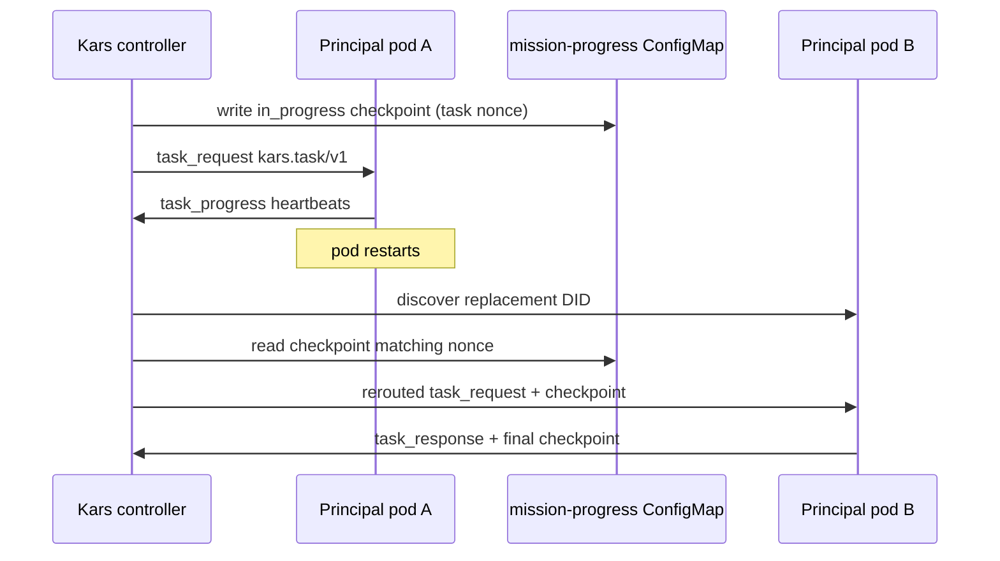

# Durable team workflows

This document explains how Kars turns a standing team charter into durable,
reviewable work. It focuses on the Kars substrate: CRDs, controller state,
runtime contracts, encrypted delegation, checkpoints, approvals, evidence, and
memory. Kars Bridge is an optional experience layer over these same primitives.

Bridge has a companion user-facing guide at `docs/team-workflows.md` in the
Bridge repository. This page remains complete without Bridge access.

## The state model

The terms below describe different scopes. They are related, but they are not
interchangeable.

| Concept | Lifetime | Source of truth | Meaning |
|---|---|---|---|
| Team | Long-lived | `KarsTeam` | Charter, org chart, authority envelope, cadence, and shared memory identity. |
| Milestone / backlog task | Long-lived until resolved | `kars-team-tasks-<team>` ConfigMap | One durable unit of work, including dependencies, acceptance criteria, and review requirements. |
| Run | One execution attempt | Task-force `KarsTask` | A nonce-scoped attempt to complete one milestone or charter tick. |
| Assignment | One controller-to-worker delivery | `KarsTask.status.assignment` | Which worker DID owns the current `kars.task/v1` contract and its progress lease. |
| Activity | Events inside a run | Mission trace plus assignment ledger | Model rounds, tool calls, lifecycle events, child assignments, handbacks, and failures. |
| Artifact | File produced during a run | `kars-mission-artifacts-<run>` ConfigMap | Agent-authored files such as reports, plans, checkpoints, or evidence ledgers. |
| Deliverable | Principal result for a run | `kars-mission-output-<run>` ConfigMap | The final synthesis and outcome classification for the run. |
| Approval | Human decision | `KarsApproval` | A typed decision such as checkpoint approval, denial/request-changes, or authority change. |
| Team commons | Approved retained knowledge | `kars-commons-<team>` ConfigMap | Knowledge injected into later runs after the appropriate review boundary. |

The stable join keys are the team name, milestone ID, run name, task nonce, and
agent DID. A run page can therefore show which team and milestone caused the
run, which agents worked, which artifacts they produced, and which approval or
memory entry resulted.

## End-to-end flow

```mermaid
flowchart LR
    Charter["Team charter and roster"] --> Backlog["Durable milestone DAG"]
    Backlog -->|"dependencies satisfied"| Run["Task-force KarsTask"]
    Run --> Contract["kars.task/v1 contract"]
    Contract --> Principal["Principal sandbox"]
    Principal --> Roles["Selected roster workers"]
    Roles --> Handbacks["Structured encrypted handbacks"]
    Handbacks --> Gate["Truthfulness and acceptance gate"]
    Gate --> Artifacts["Artifacts + principal deliverable"]
    Artifacts --> Review{"Review required?"}
    Review -->|"no"| Done["Milestone done"]
    Review -->|"yes"| Approval["KarsApproval checkpoint"]
    Approval -->|"approve"| Done
    Approval -->|"deny / request changes"| Backlog
    Done --> Commons["Team commons"]
    Commons -->|"prior knowledge"| Contract
```



Editable source:
[`08-intent-to-team.excalidraw`](../showcase/diagrams/08-intent-to-team.excalidraw).

## 1. Composition and creation

Kars itself is declarative. A team can be authored directly as a `KarsTeam`,
with milestone tasks stored in the team task ConfigMap. Bridge may propose these
objects from plain language, but the controller does not depend on Bridge.

A finite workflow uses a topologically ordered milestone graph:

- `depends_on` names earlier milestone IDs;
- `acceptance_criteria` define what completion means;
- `review_required` inserts a human checkpoint;
- only a `pending` milestone whose dependencies are `done` is eligible;
- `active` and `awaiting_review` both block later assignments.

The team is a persistent logical org. Task-force sandboxes are
resource-optimized: a fresh governed sandbox is created for a run and removed
after the terminal result is retained.

## 2. Versioned task delivery

The controller delivers work over the AGT mesh as a `kars.task/v1` envelope.
The envelope carries:

- the complete run objective;
- independently budgeted standing/team instructions;
- the current nonce-scoped checkpoint;
- a SHA-256 digest over byte-length-prefixed UTF-8 fields.

Canonical fields are also carried as base64 UTF-8 so Unicode text survives the
plaintext controller-peer transport byte-for-byte. OpenClaw and Hermes decode,
verify, and persist the same normalized `execution-contract.json`.

An invalid or tampered digest fails closed before the model executes.

## 3. Checkpoint and restart behavior

For milestone objectives, the controller creates
`kars-mission-progress-<run>` before delivery with an initial
`kars.checkpoint/v1` record:

```json
{
  "schema": "kars.checkpoint/v1",
  "milestone_id": "architecture-and-contract",
  "status": "in_progress",
  "summary": "Controller initialized the durable milestone checkpoint before task delivery."
}
```

The runtime may replace it with richer progress by calling `checkpoint` or
writing `task-checkpoint.json`; heartbeats and the terminal `task_response`
forward the latest validated checkpoint.

If the worker pod restarts:

1. the controller discovers the replacement DID;
2. the pending waiter moves to that DID;
3. the controller rereads the same nonce-scoped checkpoint;
4. it rebuilds and re-signs the `kars.task/v1` payload;
5. the replacement worker continues under the same task ID.

A checkpoint from an older run nonce is ignored.



Editable source:
[`10-checkpoint-review-memory.excalidraw`](../showcase/diagrams/10-checkpoint-review-memory.excalidraw).

## 4. Principal and specialist execution

The principal owns orchestration and final synthesis. It:

1. writes `role-plan.json`;
2. spawns selected roster roles with `kars_spawn`;
3. sends stable work-packet IDs through `kars_mesh_send`;
4. waits for correlated progress and `task_response` frames;
5. retains child trace and telemetry;
6. produces the final deliverable.

Each child is a separate sandbox and filesystem. Work packets and files cross
the AGT mesh; path references alone are not shared.

OpenClaw and Hermes use the same wire contract:

- `task_request`;
- periodic `task_progress`;
- optional `file_transfer`;
- terminal `task_response` with `ok`, artifacts, trace, telemetry, and checkpoint.

The AGT relay and router see opaque Signal Protocol ciphertext. The agent
process owns X3DH and Double Ratchet state.

Editable source:
[`09-run-execution-signal.excalidraw`](../showcase/diagrams/09-run-execution-signal.excalidraw).

## 5. Truthfulness and recovery

Kars does not treat a confident narrative as success. The controller validates:

- the selected/skipped role plan;
- spawn evidence for every selected logical role;
- mesh assignment evidence;
- at least one successful structured handback per selected role;
- substantive output or declared no-change;
- failure-shaped output patterns;
- artifact and collaboration readability.

A logical role may have multiple worker generations. A failed worker can be
destroyed and respawned under a new member name; the latest successful
generation satisfies the logical role. Successful assignments are idempotent
and cannot be resent accidentally.

Failed runs return the milestone to `pending`. Emergency stop pauses the team,
unlaunches the active run, preserves evidence, and prevents an immediate
replacement.

## 6. Review gates and memory

A successful milestone with `review_required=true` becomes
`awaiting_review`. The controller creates a typed
`KarsApproval(action.kind=checkpoint)`.

- **Approve:** mark the milestone `done`, promote the approved output to team
  commons, and unlock dependent milestones.
- **Deny / request changes:** append feedback with the source run, return the
  milestone to `pending`, and do not promote the rejected output to memory.

Approval decisions are reconciled after the source sandbox is retired; they do
not depend on Bridge being online.

Later runs receive approved commons entries inside an explicitly untrusted
reference-data frame. Prior content is useful context, never new authority.

## 7. Evidence files

The most useful retained files are:

| File | Purpose |
|---|---|
| `execution-contract.json` | Verified objective, instructions, checkpoint, and digest. |
| `role-plan.json` | Selected/skipped logical roles and worker generation mapping. |
| `collaboration.jsonl` | Spawn, assignment, handback, retry, and recovery events. |
| `subagent-telemetry.jsonl` | Bounded child trace/telemetry retained after child teardown. |
| `task-checkpoint.json` | Human-readable milestone progress and acceptance state. |
| Principal-authored artifacts | Reports, plans, code, claim ledgers, test evidence, and handoffs. |

Mission output, artifacts, trace, approvals, receipts, and commons are durable
Kubernetes resources. A UI may project them, but it is not their source of
truth.

## 8. Engineering intake

Engineering intake is a source of backlog tasks, not a separate execution
engine. It observes connected repositories for configured signals, canonicalizes
each work item, and queues a team milestone/task.

The relationship is:

```text
GitHub signal -> engineering intake item -> team backlog task -> run
              -> activity + role artifacts -> principal deliverable
              -> CI/readiness observation -> review/merge decision
```

Activity belongs to the run. Artifacts belong to agents within the run. The
deliverable belongs to the principal. Intake links the original repository
signal to the exact run and readiness state.

## 9. Operational inspection

When a run is confusing, inspect in this order:

1. `KarsTeam` status and the team task ConfigMap;
2. the bound task-force `KarsTask.status.assignment` and assignment events;
3. `kars-mission-progress-<run>`;
4. mission trace and artifact ConfigMaps;
5. mission output status, collaboration error, and truthfulness result;
6. typed `KarsApproval` or `EgressApproval` objects;
7. sandbox/router logs only after the durable state above.

Do not use an agent-authored summary as the root cause when the controller
ledger, tool result, or remote HTTP status provides a more direct explanation.
