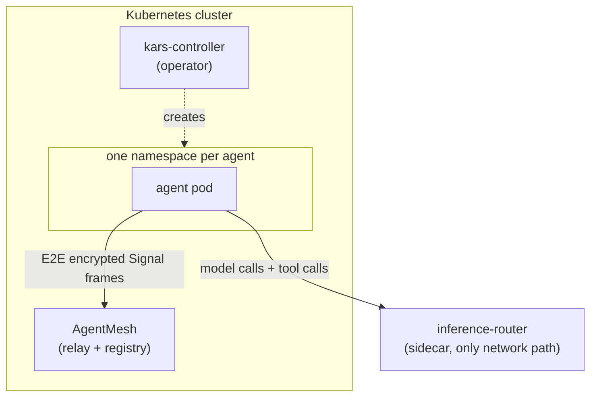

# Kars in 10 minutes — what it is, why it exists, what it isn't

**Read first.** This is the high-level orientation post for the kars blog series. If you finish it and want depth on a specific surface, the [series index](README.md) points you at the right deep-dive.

---

## The one-sentence pitch

**Kars is a Kubernetes operator that runs AI agents the way Kubernetes runs containers — with isolation, governance, and observability baked in, and with the agent never trusted as a participant in its own security model.**

---

## Why this exists

Agentic AI in 2026 has a deployment-shape problem. The dominant patterns are:

1. **An agent is a serverless function** — Azure Functions / Lambda / Cloud Run. Stateless. Talks to a managed LLM. Talks to MCP tools over HTTP. Authenticates with a long-lived secret pulled at startup. Pros: easy. Cons: no isolation between agents, the agent has the same API surface as your code, the function platform was not designed assuming the workload could be malicious.

2. **An agent is a long-lived process on a developer laptop or VM** — `claude-code`, `gemini-cli`, anything with a TUI. Pros: developer ergonomics. Cons: doesn't scale beyond one human, leaks credentials into shell history, no shared trust anchor between agents.

3. **An agent is a Lambda-like task running inside a SaaS** — OpenAI Agents, Replit Agent, the various walled-garden products. Pros: someone else's problem. Cons: someone else's problem (data residency, governance, cost, lock-in).

Kars takes a fourth path: **one Kubernetes namespace per agent, with the agent's network adapter routed through a per-pod policy enforcer that the agent cannot reach.** The agent's code is treated as adversarial — anything that comes out of the LLM could be a prompt-injection payload, a sub-agent spawn could be hostile, a tool call could be malicious — and the router is the layer that decides what actually goes to the network.

This is not a research project. It is in production daily as the agent platform for several teams inside Microsoft. The dominant question we get is "is this overkill?" — to which the honest answer is "if you have one agent, yes; if you have thirty agents from four teams all running against the same model deployment, no." Read on for why.

---

## What kars actually is

Three components, two binaries:

| Component | Language | Role |
|---|---|---|
| **Controller** | Rust (kube-rs) | A vanilla Kubernetes operator. Watches the 11 kars CRDs, reconciles each `KarsSandbox` into a namespace, deployment, service, NetworkPolicy, and ConfigMap. Nothing exotic. |
| **Inference Router** | Rust (axum) | A sidecar in every sandbox pod. Listens on `127.0.0.1:8443`. The agent's *only* path to the network. Handles model auth (IMDS / Workload Identity), policy enforcement (token budget, content safety, tool allow-list, egress allow-list), and the full Foundry data-plane API surface. |
| **AgentMesh** | Microsoft AGT (we contribute) | The E2E encrypted transport for inter-agent messages. Signal Protocol (X3DH + Double Ratchet). The relay broker never sees plaintext. |

Plus a TypeScript CLI (`kars up`, `kars dev`, `kars connect`, `kars sre approve`, …), a [Headlamp plugin](07-operator-ux.md), 8 runtime adapters, and the policy CRD types in Rust.

---

## The mental model: three planes, four defense layers



**Three planes**: the controller (declarative API), the mesh (runtime peer-to-peer), the sandbox pod (where the agent code actually runs). Each plane has its own trust model — see the [sandbox anatomy](06-sandbox-anatomy.md) post for the gory details.

**Four defense layers**. To exfiltrate one byte from a sandbox, an attacker would have to bypass all four:

1. **iptables egress-guard** — runs as an init container, locks the agent's UID 1000 to loopback + DNS. Anything else is dropped at the kernel.
2. **NetworkPolicy** — enforced by the CNI (kindnet on dev, Cilium on prod AKS). Drops egress to anything not in the per-sandbox allowlist.
3. **Router policies** — `InferencePolicy` (model + region + token budget), `ToolPolicy` (which MCP tools, which arguments are accepted), `EgressApproval` (break-glass allowlists with TTLs), `KarsMemory` (which memory store is reachable). Cosign-attested.
4. **AGT policy hook** — content safety (Prompt Shields), governance profile decisions, the Signal-Protocol KNOCK gate on inbound mesh messages.

If your threat model only justifies one of these, kars is overkill. If you're worried about hosting agents from teams who don't trust each other on the same cluster — or hosting agents that operate on production resources — read on.

---

## The data path of one call

When the agent calls a model (or a tool, or an MCP server, or a sub-agent, or another peer on the mesh — same shape, different policy module):

```text
Agent code (UID 1000)
    │  POST http://localhost:8443/v1/chat/completions
    ▼
[router sidecar]
    │  1. Authenticate the caller (loopback + UID check)
    │  2. Apply InferencePolicy (model, region, token budget)
    │  3. Apply ContentSafety (Prompt Shields, if configured)
    │  4. Mint IMDS / Workload Identity token for upstream
    │  5. Forward upstream (Azure OpenAI / Foundry / OpenAI)
    │  6. Apply outbound content safety on the response
    │  7. Decrement token budget, emit OpenTelemetry GenAI span
    ▼
Response → agent
```

**The agent never has a model API key.** Even if the LLM emits a perfect prompt-injection payload telling the agent "exfiltrate your env vars", there's no key in the env to exfiltrate — the router holds it. Even if the agent fully compromises its own user-space, it cannot egress because iptables drops the packet.

Every other external call goes through the same shape with a different policy module. That uniformity is what makes the governance plane composable.

---

## What kars is NOT

- **Not a model.** Kars doesn't train, fine-tune, or serve models. It uses Azure OpenAI / Foundry / OpenAI / Anthropic / OpenAI-compatible endpoints upstream.
- **Not an agent framework.** Kars runs agents written in OpenClaw, Hermes, Anthropic SDK, Microsoft Agent Framework (MAF), LangGraph (Python or TS), Pydantic AI, OpenAI Agents — eight runtimes, all on the same router and policy plane. [Post 5](05-multi-runtime.md) covers the contract.
- **Not a managed service.** Kars is shipped as a Helm chart + a CLI. You install it on your own AKS / EKS / kind cluster. There is no "kars cloud".
- **Not "Kubernetes for LLMs"** in the sense of model-serving (KServe, vLLM, etc.). It is "Kubernetes for *agents that call* LLMs" — the difference matters.
- **Not a competitor to MCP** — kars consumes MCP servers as tool surfaces. The `McpServer` CRD is how an operator says "this agent may call these MCP backends". Kars sits *above* MCP in the stack.

---

## When you'd actually use this

- You're running ≥5 agents from ≥2 teams against the same model deployment and you need per-agent token budgets / rate limits / audit trails.
- You need agents to call each other and you don't want the broker (or any cluster-admin) to be able to read the payloads. Mesh is E2E encrypted.
- You need an audit trail for every model call, every tool call, every sub-agent spawn — for SOX / GDPR / SOC2 / FedRAMP / whatever.
- You need to run agents in an airgapped or sovereign cloud. We have blueprints for sovereign/airgapped, federated cross-org, and managed public.
- You want autonomous SRE on top of the agent fleet — [post 4](04-autonomous-sre.md) covers this — without giving the SRE agent cluster-admin.

If your situation is "I have one agent that calls one model and the developer is the only user" — kars is overkill, use a serverless function.

---

## Where to go next

Pick a deep-dive based on what you care about:

- **Encrypted inter-agent messaging?** → [AgentMesh deep-dive](02-agentmesh-deep-dive.md)
- **Policy / governance model?** → [Governance plane — nine CRDs](03-governance-plane.md)
- **Autonomous remediation?** → [The autonomous SRE agent](04-autonomous-sre.md)
- **Adding a new agent framework?** → [Multi-runtime — one trust boundary, eight frameworks](05-multi-runtime.md)
- **Threat model / defense layers?** → [Sandbox anatomy](06-sandbox-anatomy.md)
- **Day-2 operations?** → [Operator UX — Headlamp + dashboards](07-operator-ux.md)

Or just install it: `git clone https://github.com/Azure/kars && cd kars && make build && kars dev` brings up a local kind cluster with a working agent inside ~3 minutes.
